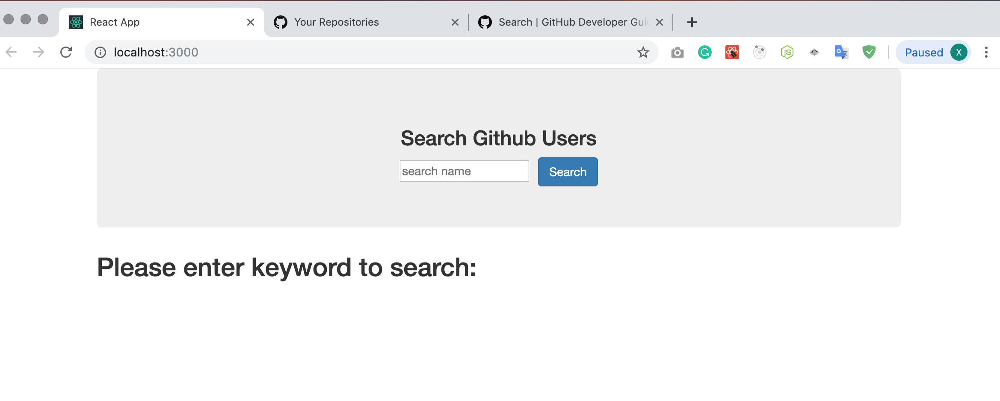
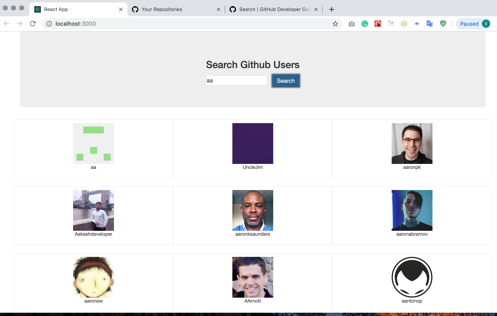

This project was bootstrapped with [Create React App](https://github.com/facebook/create-react-app).

## Available Scripts

In the project directory, you can run:

### `npm install --save prop-types`
### `npm install --save axios`
### `npm start`

Runs the app in the development mode. 
Open [http://localhost:3000](http://localhost:3000) to view it in the browser.

The page will reload if you make edits. 
You will also see any lint errors in the console.

### `Demo screenshot and Introduce`
This demo is using Github api to search github user and show the result. 
The main point is 'componentWillReceiveProps().'
 
Github website api: https://developer.github.com/v3/search/#search-users
Request url: https://api.github.com/search/users?q=
 
This is search page.

After enter keyword, will show result below
